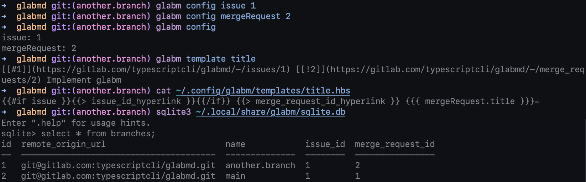

# glabm

glabm prints out custom templates for your GitLab issues and merge requests. It's also git branch aware.

Example:


## Install

```bash
git clone git@github.com:mattkhan/glabm.git
cd glabm
npm i
npm run migrate
npm run build
npm pack
npm i -g glabm-1.0.0.tgz # installs glabm globally
```

Place your personal GitLab token in `~/.config/glabm/token.txt`.

Place your Handlebars templates in `~/.config/glabm/templates`. More info in [glabm template](#glabm-template).

Samples are in [docs/samples/templates](docs/samples/templates), you can copy them over to start as a base.

## `glabm config`

Sets and gets `issue` and `mergeRequest` based on the working directory's git remote origin url and branch.

The branch and remote origin url are fetched by:

- branch: `git branch --show-current`
- remote origin url: `git config --get remote.origin.url`

The `--unset` flag can be used to set `issue` or `mergeRequest` to `null`.

Values are saved in a local SQLite table in `~/.local/share/glabm/sqlite.db`.

Example usage:

```console
$ glabm config issue 1
$ glabm config mergeRequest 2
$ glabm config issue
1
$ glabm config mergeRequest
2
$ glabm config
issue: 1
mergeRequest: 1
$ glabm config --unset issue
$ glabm config
issue: null
mergeRequest: 1
```

## `glabm template`

Prints out custom templates based on the `glabm config` configured `issue` and `mergeRequest` values for the current git branch and remote origin url pair.

The values for `issue` and `mergeRequest` can be overridden with the `--mergeRequest` and `--issue` flags, e.g. `--issue=1`.

Add handlebar templates to `~/.config/glabm/templates`.

Templates used in `glabm template <name>` _must_ exist directly under the `templates` directory.

e.g.

```
.config/
  glabm/
    templates/
      partials/
        issue_id_hyperlink.partial.hbs
      title.hbs
      review.hbs
```

allow for

```bash
glabm template title
glabm template review
```

Partials can be defined under the `templates` directory, and in any subdirectory of `templates`, with the extension `.partial.hbs`.

Partials are globally available by their file name. Using the example above, `{{> issue_id_hyperlink }}` would be an available partial. Partials are not prefixed by subdirectories they are under.

The available global variables in templates are `issue` and `mergeRequest`, with the schema defined below.

Arbitrary data can be added as globally available variables with the `--data` or `--data-file` options. Both options require the data to be formatted in JSON with the variables nested under the `variables` key, e.g. `--data='{ "variables": { "postMessage": "hi" } }'`.

`--data` requires a JSON string as an argument.

`--data-file` requires the path to a file under `~/.config/glabm/templates/`.

```typescript
type Issue = {
  iid: string;
  title: string;
  webUrl: string;
};

type MergeRequest = {
  iid: string;
  title: string;
  webUrl: string;
};

type TemplateData = { issue: Issue | null; mergeRequest: MergeRequest };

let template: HandlebarsTemplateDelegate;
template({ issue, mergeRequest } satisfies TemplateData);
```

Example variable access:

```hbs
{{mergeRequest.title}}
```

Example usage:

```bash
glabm template title
glabm template title_with_data --data='{ "variables": { "postMessage": "hi" } }'
glabm template title_with_data --dataFile=data.json

# Override `glabm config` configured issue and mergeRequest values.
# Defaults to the `glabm config` configured values for any key that
# isn't present.
glabm template title --mergeRequest=1 --issue=2
```

## Demo

https://github.com/mattkhan/glabm/assets/86168986/ea7c8938-752b-4eea-9317-94eec1edf23f

## Help

```bash
glabm --help
glabm config --help
glabm template --help
```

The help commands exist but they're not very descriptive. Yet.

## Development

Some commands if you want to hack around

```bash
# GraphQL Code Generator
npm run build # transpiles loader.ts for codegen to use
npm run generate

# run database migrations
npm run drizzle-kit generate:sqlite # required if schema updated
npm run migrate
```

```bash
# hot reload build
npm run watch

# example command
npm run glabm -- template title --issue=2 --mergeRequest=5
```

Project status: Very much happy path development, not much error surfacing, and no unit tests.

Built using TypeScript, yargs, Drizzle ORM + Sqlite3, Apollo, GraphQL Code Generator, and Handlebars.
